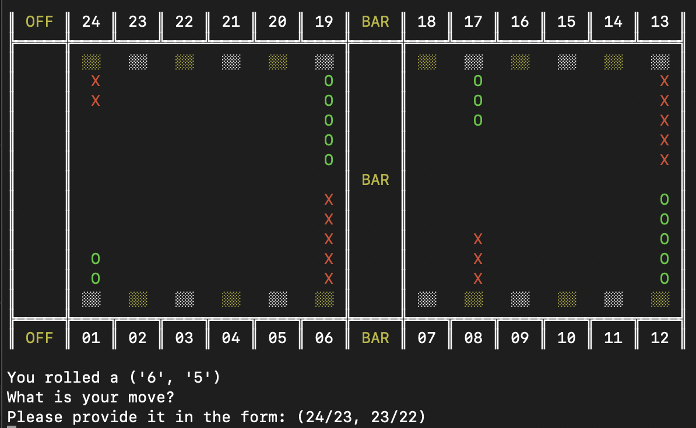
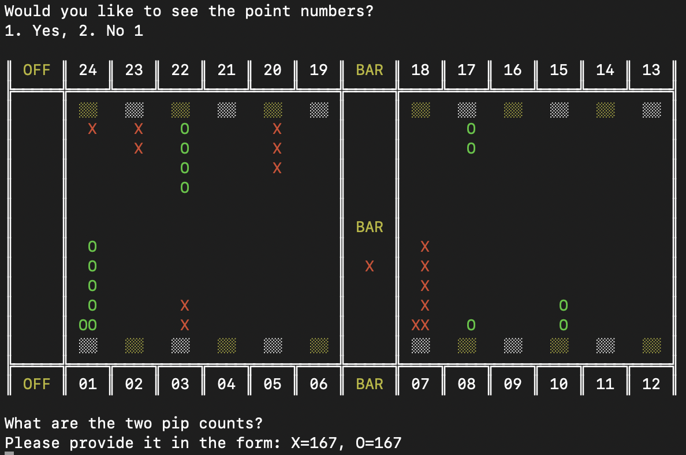

# Backgammon Trainer

Want to get better at backgammon? You'll need practice.

## Trainers

### Point number trainer
To help you identify what point a checker is on more quickly!


### Opening move trainer
To help you memorize the best opening plays!!


### Pip count trainer
Practice your pip-counting!!!


## Features
* Bear-off on the left OR the right!

* Track results! Break your record!
  

## Installation
We can use conda (or better yet [mamba](https://github.com/conda-forge/miniforge)) to maintain an isolated python environment:

```
## create the environment
mamba create -n bgtrainer -c conda-forge "python>=3.10" --file requirements.txt

## install package without using pip for dependencies
pip install --no-build-isolation --no-deps .
```

To run, simply activate the appropriate environment and run:

 ```
 conda activate bgtrainer
 python main.py
 ```

### For developers

You will want to install other tools, as well as adding git commit hooks:

```
## installs the additional requirements, without updating pkgs
mamba install -n bgtrainer --freeze-installed --file requirements-dev.txt

## editable install of the package without using pip for dependencies
pip install --no-build-isolation --no-deps -e .

pre-commit install
```
