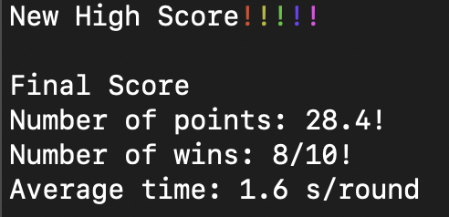

# Backgammon Trainer

Want to get better at backgammon? You'll need practice.


## Trainers

### Point number trainer
To help you identify what point a checker is on more quickly!


### Pip count trainer
Practice your pip-counting!!


### Relative pip count trainer
Figure out who's leading the race in record speed!!!


### iSight trainer
Perfect your bear-off cubing skills!!!!


## Features
* Bear-off on the left OR the right!

* Track results! Break your record!

  

## Installation

Download the [latest release](/releases/latest) for your platform.

### For developers

Use conda (or better yet [mamba](https://github.com/conda-forge/miniforge)) to create an isolated python environment:

```
## create and activate the environment
mamba create -n bgtrainer -c conda-forge "python>=3.11" --file requirements.txt
conda activate bgtrainer

## install additional requirements without updating pkgs
mamba install -n bgtrainer --freeze-installed --file requirements-dev.txt

## editable install of the package without using pip for dependencies
pip install --no-build-isolation --no-deps -e .

## activate pre-commit:
pre-commit install
```

To run, simply activate the appropriate environment and run `bgtrainer`:

 ```
 conda activate bgtrainer
 bgtrainer
 ```
